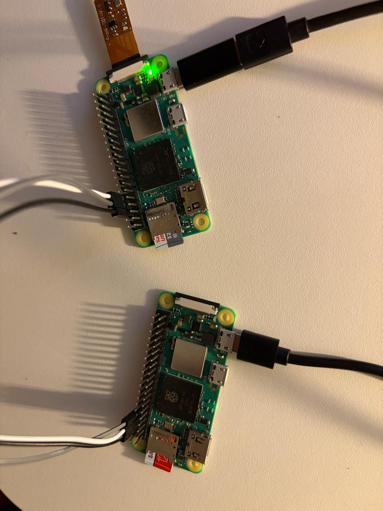

# SerialLink Command / Telemetry Protocol over UART

This project implements a **Command / Telemetry protocol over UART** with framing, CRC validation, and robustness against partial frames, corruption, and burst traffic.

The application is designed for:
- Linux user-space testing
- Pseudo-terminal based simulation
- Real hardware UART testing (Raspberry Pi Zero 2W)

---

## 1. Compilation (Linux)

### 1.1 Build

Compile the application using `make`:

```bash
make
```

The resulting binary will be generated in the build directory.

### 1.2 Dependencies

gcc - Tested with versions: 9.4.0, 13.3.0, 14.2.0
GNU Make 4.3


## 2. Setup

The application can be tested using either pseudo terminals or real UART hardware. 

### 2.1 Pseudoterminal /dev/pts/#

Pseudo terminals are useful for development, debugging, and fault-injection testing without physical hardware. Use below command to create /dev/pts pair. Test it with echo and cat utilities.

```bash
socat -d -d PTY,raw,echo=0 PTY,raw,echo=0
```

### 2.2 Hardware Testing (Raspberry Pi Zero 2W)

I have tested with 2 raspberry zero 2w devices. The Tx and Rx lines are crossed.

| Raspberry Pi Zero 2W | Raspberry Pi Zero 2W |
| -------------------- | ---------------------|
| GPIO14 (TXD)         | GPIO15 (RXD)         |
| GPIO15 (RXD)         | GPIO14 (TXD)         |
| GND                  | GND                  |




#### 2.2.1 Disable Serial Console

The default Linux serial console must be disabled to use the UART for the application. It can be changed via /boot/firmware/console.txt or via raspi-config

```
Interface Options → Serial Port → Disable the login shell over serial → Enable the hardware serial port
```
Reboot both devices after applying changes.

#### 2.2.2 Configure UART Parameters

The primary UART device on Raspberry Pi Zero 2W is typically: /dev/ttyAMA0

Configure the UART settings on both devices:

```bash
stty -F /dev/ttyAMA0 115200 cs8 -cstopb -parenb -ixon -ixoff -crtscts raw
```

This sets:

Baudrate: 115200
8 data bits
No parity
1 stop bit
No software flow control
No hardware flow control
Raw mode


## 3. Testing

Use -h to see available options. See below commands for example test.

```bash
pi@pi:~/seriallink$ ./build/app -h

Command/Telemetry Protocol

-d              DEVICE (Device full path. i.e. /dev/pts/1)
-m              MODE App mode. 1->Write  2->Read.
-r              Generate n frames with random payload. [0..1000].
-p              Packet drop policy when rx queue is full. 0->Drop new frame  1->Overwrite the oldest frame.
-e              Enable Inject Error for testing
-v              Verbose output for debugging.
-h              Print this help message.
```

The below commands will send 15 Frames with randomly generated payload. The queue dropping policy is set to Drop new frames when queue is full. Queue size is 8 Frames by default. 
RX:

```bash
./build/app -d /dev/ttyAMA0 -m 2 -p 0 -v
```

TX:
```bash
./build/app -d /dev/ttyAMA0 -m 1 -r 15 -v
```

## 4. Notes

Tweaking the sleeping times during each Frame transfer or validation on Rx side affects the number of successful transmission.